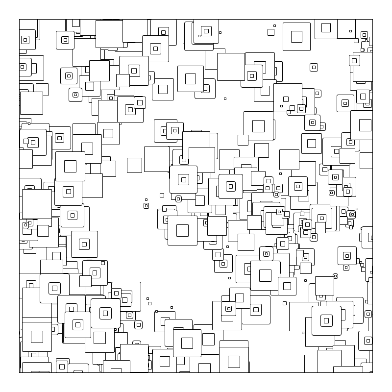
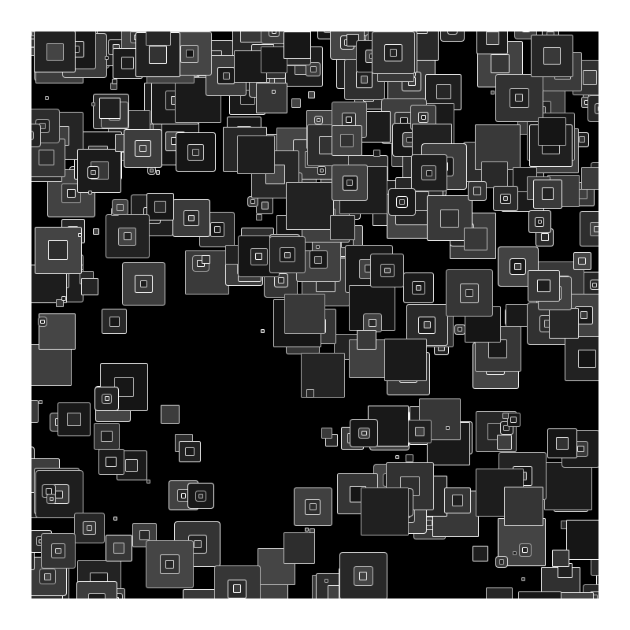

# processing

Experiments, 2024

## Week 1 (June 24)

### Squares

**Program:** 2024/week1/squares/squares.pde

Construct random nested squares using the normal distribution.
Principles: repetition, randomness, subdivision.  See [Fundamental Elements Of Generative Art (Eugen Lindwurm)](https://towardsdatascience.com/fundamental-elements-of-generative-art-11175f4741e5)

### Squares2

Like squares, but set probability of creation of a square in specified regions to zero and increase the number of squares generated.
Principles: as in square, but break the pattern.

## Week 2 (July 1)

### Evolution
