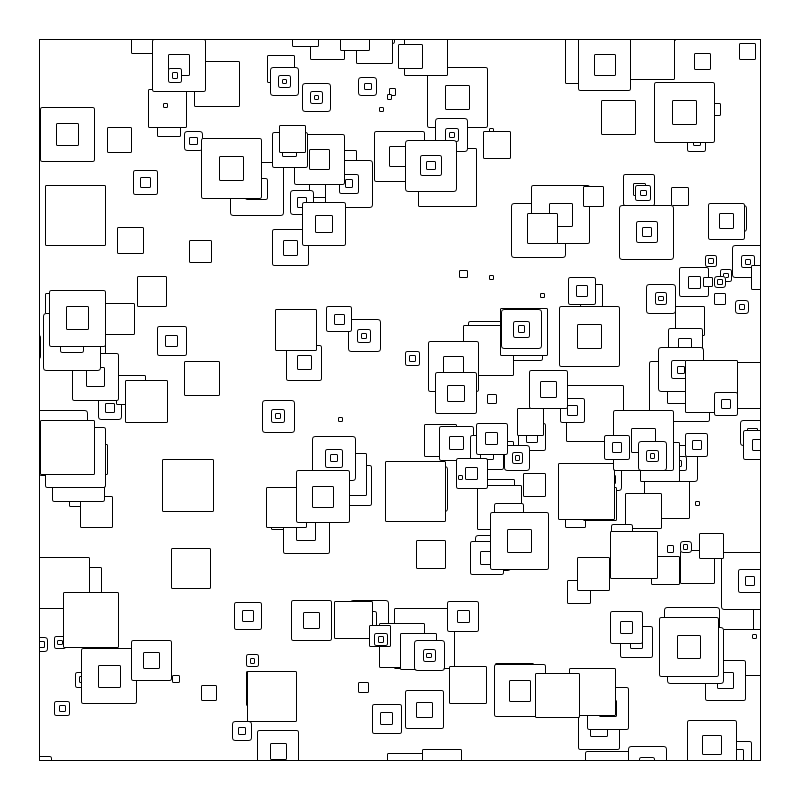

# processing

Experiments, 2024

## Week 1 (June 28)

**Program:** 2024/week1/squares/squares.pde

Construct random nested squares using the normal distribution.
Principles: repetition, randomness, subdivision.  See [Fundamental Elements Of Generative Art (Eugen Lindwurm)](https://towardsdatascience.com/fundamental-elements-of-generative-art-11175f4741e5)
